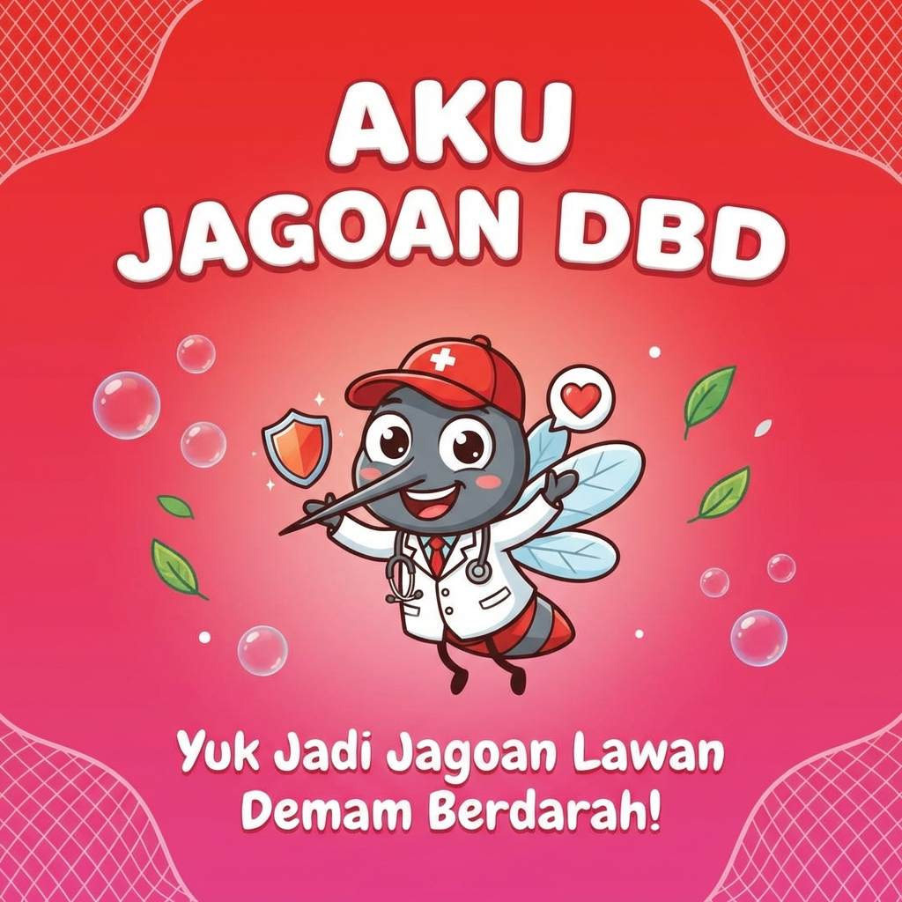

# 🦟 Aku Jagoan DBD
**Yuk Jadi Jagoan Lawan Demam Berdarah!**

Website edukasi interaktif yang dirancang khusus untuk anak-anak sekolah dasar (SD) agar lebih memahami bahaya dan cara pencegahan Demam Berdarah Dengue (DBD) dengan cara yang menyenangkan.



## ✨ Fitur Utama

- **Mascot "Dokter Nyamuk"**: Karakter pemandu ramah anak yang menemani di setiap halaman.
- **Quiz Interaktif**: Game quiz dengan sistem poin, badge penghargaan, dan animasi confetti.
- **Materi Edukasi Visual**: Penjelasan tentang gejala dan pencegahan (3M Plus) dengan bahasa sederhana.
- **Cerita Bergambar**: Slide cerita inspiratif tentang anak yang menjadi pahlawan kesehatan.
- **Desain Modern**: Menggunakan gaya *Glassmorphism* dengan warna cerah yang menarik bagi anak-anak.
- **Responsive**: Tampilan optimal di Smartphone, Tablet, dan Desktop.

## 🛠️ Teknologi yang Digunakan

- **HTML5**: Struktur semantik website.
- **CSS3** (Vanilla): Styling modern, flexbox, grid, animasi, dan responsivitas.
- **JavaScript** (Vanilla): Logika quiz, interaksi modal, dan dinamika navigasi.

## 📂 Struktur Folder

```
/
├── index.html          # Halaman utama website
├── css/
│   └── style.css       # Semua styling CSS
├── js/
│   └── main.js         # Logika JavaScript
└── assets/             # Folder gambar dan aset
    ├── mascot-dbd.png  # Gambar karakter mascot
    └── og-image.png    # Gambar preview sosial media
```

## 🚀 Cara Menjalankan Project

### 1. Clone Repository (atau Download ZIP)
```bash
git clone https://github.com/riskiputraalamzah/dbd.git
cd dbd
```

### 2. Buka di Browser
Cukup buka file `index.html` menggunakan browser favoritmu (Chrome, Firefox, Edge, Safari).

**Atau gunakan Live Server (VS Code Extension):**
Klik kanan pada `index.html` dan pilih "Open with Live Server".

## 🌐 Deployment (GitHub Pages)

Website ini siap dideploy menggunakan GitHub Pages:
1. Push kode ke repository GitHub.
2. Masuk ke **Settings** > **Pages**.
3. Pada bagian **Build and deployment**, pilih Source: **Deploy from a branch**.
4. Pilih branch **master** atau **main**, lalu klik **Save**.
5. Tunggu beberapa saat, website akan live di `https://username.github.io/dbd/`.

## 👨‍💻 Author

Dibuat dengan ❤️ sebagai tugas **UAS Desain Komunikasi dan Multimedia**.
**Riski Putra Alamzah**

---
*Mari bersama-sama wujudkan Indonesia bebas Demam Berdarah! 💪*
